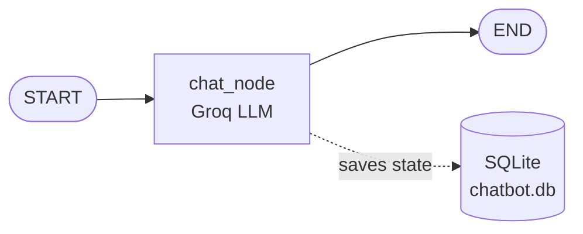
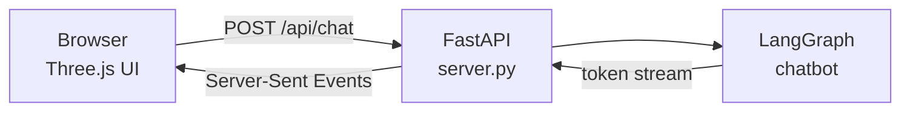

<div align="center">

# 🧠 LangGraph Chatbot

### A memory-powered AI chatbot with a 3D interface

Built with **LangGraph** · **Groq** · **SQLite** · **Streamlit** · **FastAPI** · **Three.js**


[Features](#-features) · [Screenshots](#-screenshots) · [Quick Start](#-quick-start) · [How It Works](#-how-it-works) · [Project Structure](#-project-structure) · [Troubleshooting](#-troubleshooting)

</div>

---

## ✨ Features

- 💬 **Streaming replies**: tokens appear as the model writes them
- 🗂️ **Multiple conversations**: start a new chat any time and switch between old ones
- 💾 **Persistent memory**: chats are saved in SQLite and survive restarts
- 🌌 **3D interface**: a glass chat panel over a live 3D view of the LangGraph itself. A light pulse travels `START → chat_node → END` while the AI answers
- 🧪 **Step-by-step Streamlit versions**: learn how the chatbot grows from basic to database-backed
- ⚡ **Fast inference**: powered by Groq (`openai/gpt-oss-20b`)

## 📸 Screenshots

### Streamlit UI (`localhost:8501`)

<table>
  <tr>
    <td align="center"><b>Home and saved conversations</b></td>
  </tr>
  <tr>
    <td></td>
  </tr>
</table>

<table>
  <tr>
    <td align="center"><b>Streamed answer with a table</b></td>
    <td align="center"><b>Same answer, scrolled</b></td>
  </tr>
  <tr>
    <td></td>
    <td></td>
  </tr>
</table>

### 3D UI (`localhost:8000`)

<!-- Add your screenshot here:

-->

Run the 3D UI (see [Quick Start](#-quick-start)) and drop a screenshot into `screenshots/`.

## 🚀 Quick Start

**Requirements:** Python 3.10+, a free [Groq API key](https://console.groq.com)

**1. Clone the repo**

```bash
git clone https://github.com/osamashabih6960/Build-a-chatbot-Using-Lang-Graph.git
cd Build-a-chatbot-Using-Lang-Graph
```

**2. Create a virtual environment**

```bash
python -m venv .venv

# Windows
.venv\Scripts\activate

# Mac / Linux
source .venv/bin/activate
```

**3. Install dependencies**

```bash
pip install -r requirements.txt
pip install -r requirements-ui.txt
```

**4. Add your API key**

Create a file named `.env` in the project root:

```env
GROQ_API_KEY=your_groq_key_here
```

> ⚠️ Never commit `.env`. Make sure it is listed in `.gitignore`.

**5. Run it**

| UI | Command | URL |
|---|---|---|
| 🌌 3D UI | `uvicorn server:app --reload` | http://localhost:8000 |
| 🖥️ Streamlit (with SQLite) | `streamlit run streamlit_frontend_database.py` | http://localhost:8501 |

Both can run at the same time in separate terminals. Stop either one with `Ctrl + C`.

## 🧩 How It Works



1. The user's message is added to `ChatState`, a list of messages merged with `add_messages`.
2. `chat_node` sends the full history to the LLM and appends the reply.
3. The checkpointer saves the state under a `thread_id`, so each conversation keeps its own memory.

| Checkpointer | Storage | Survives restart? |
|---|---|---|
| `InMemorySaver` | RAM | ❌ No |
| `SqliteSaver` | `chatbot.db` | ✅ Yes |

### 3D UI architecture



### API endpoints

| Method | Endpoint | Purpose |
|---|---|---|
| `GET` | `/` | Serves the 3D UI |
| `GET` | `/api/threads` | Lists saved conversations |
| `GET` | `/api/threads/{id}` | Loads one conversation |
| `GET` | `/api/new` | Creates a new thread id |
| `POST` | `/api/chat` | Sends a message, streams the reply |

## 📁 Project Structure

```text
.
├── langgraph_backend.py              # Graph + in-memory checkpointer
├── langgraph_database_backend.py     # Graph + SQLite checkpointer
├── server.py                         # FastAPI server for the 3D UI
├── static/
│   └── index.html                    # 3D UI (Three.js, single file)
├── streamlit_frontend.py             # 1. Basic chat
├── streamlit_frontend_streaming.py   # 2. + token streaming
├── streamlit_frontend_threading.py   # 3. + multiple threads
├── streamlit_frontend_database.py    # 4. + saved in SQLite
├── screenshots/                      # README images
├── requirements.txt
├── requirements-ui.txt
└── chatbot.db                        # Created automatically
```

## 🎨 Customize the 3D Scene

Open `static/index.html` and edit:

- `cols`: node colors
- `pts`: node positions (add a point to add a node, useful if you extend the graph with tools)
- the CSS variables at the top (`--teal`, `--pink`, `--bg`) to change the whole theme

## 🛠️ Troubleshooting

| Problem | Fix |
|---|---|
| `ModuleNotFoundError: langchain_groq` | Run `pip install -r requirements-ui.txt` with `.venv` active |
| Groq authentication error | Check `GROQ_API_KEY` in `.env`, then restart the server |
| 3D background is blank | Three.js loads from a CDN, so check your internet connection |
| PowerShell blocks `activate` | Run `Set-ExecutionPolicy -Scope CurrentUser RemoteSigned` once |
| Port already in use | Add `--port 8001` to the `uvicorn` command |

## 🗺️ Roadmap

- [ ] Tool calling (web search, calculator)
- [ ] Rename and delete conversations
- [ ] Markdown rendering with syntax highlighting
- [ ] Docker setup

## 📄 License

Released under the [MIT License](LICENSE).

<div align="center">

Built by **[osamashabih6960](https://github.com/osamashabih6960)** · If this helped you, give it a ⭐

</div>