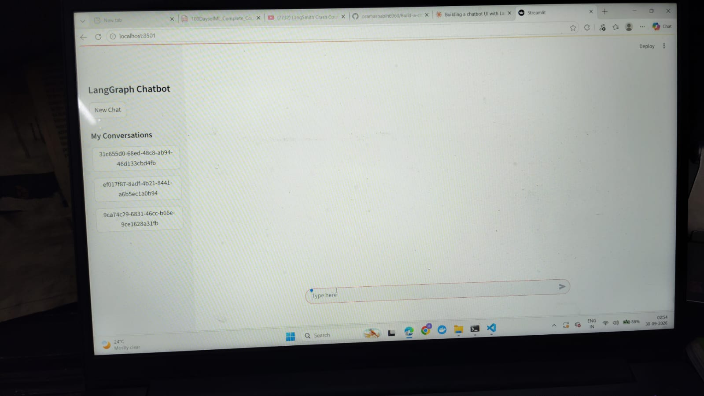
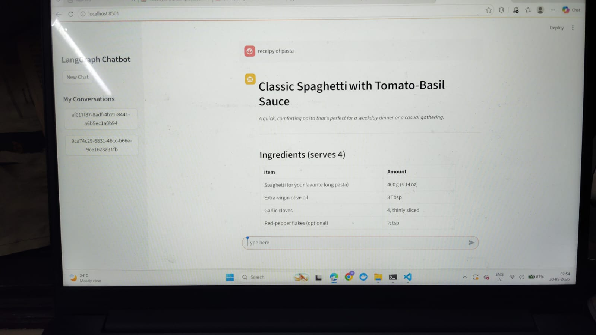
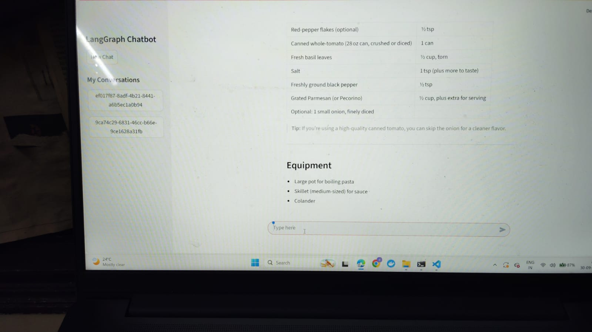

# LangGraph Chatbot with a 3D Interface

A chatbot built with **LangGraph**, powered by **Groq** (`openai/gpt-oss-20b`), with conversation memory stored in **SQLite**. It has two front ends:

- **3D web UI** (new): a glass chat panel over a live Three.js scene of the graph itself. While a reply streams, a light pulse travels `START → chat_node → END`.
- **Streamlit apps**: the original step-by-step versions.

## Screenshots

Streamlit version (`streamlit_frontend_database.py`) running locally on port 8501. Past conversations load from SQLite in the sidebar.

**Home: conversation list and empty chat**



**Chat: streamed answer with a table**



**Chat: the same reply, scrolled down**



## How it works

```
START ──► chat_node ──► END
             │
             └─ Groq LLM, state = list of messages
```

- `ChatState` holds a `messages` list merged with `add_messages`.
- `chat_node` sends the messages to the LLM and appends the reply.
- A checkpointer stores each conversation by `thread_id`. `InMemorySaver` loses data on restart; `SqliteSaver` writes to `chatbot.db` so conversations survive.

## Project structure

| File | Purpose |
|---|---|
| `langgraph_backend.py` | Graph with in-memory checkpointer |
| `langgraph_database_backend.py` | Graph with SQLite checkpointer and `retrieve_all_threads()` |
| `server.py` | FastAPI server that streams replies to the 3D UI |
| `static/index.html` | 3D UI (Three.js, single file) |
| `streamlit_frontend.py` | Basic Streamlit chat |
| `streamlit_frontend_streaming.py` | Streamlit with token streaming |
| `streamlit_frontend_threading.py` | Streamlit with multiple threads |
| `streamlit_frontend_database.py` | Streamlit with threads saved in SQLite |

## Setup

```bash
git clone https://github.com/osamashabih6960/Build-a-chatbot-Using-Lang-Graph.git
cd Build-a-chatbot-Using-Lang-Graph

python -m venv .venv
source .venv/bin/activate        # Windows: .venv\Scripts\activate

pip install -r requirements.txt
pip install -r requirements-ui.txt
```

Create a `.env` file in the project root:

```
GROQ_API_KEY=your_groq_key_here
```

Get a key at <https://console.groq.com>.

## Run the 3D UI

Copy `server.py`, `static/` and `requirements-ui.txt` into the repo root, then:

```bash
uvicorn server:app --reload
```

Open <http://localhost:8501/>.

## Run the Streamlit versions

```bash
streamlit run streamlit_frontend_database.py
```

## Notes

- `langchain-groq` is imported by the backends but missing from the original `requirements.txt`. `requirements-ui.txt` adds it.
- The repo commits `myenv/` (a virtual environment). Add it to `.gitignore` and remove it from git with `git rm -r --cached myenv`.
- The 3D UI loads Three.js from a CDN, so it needs an internet connection the first time.

## Customising the 3D scene

In `static/index.html`, edit the `cols` array for node colours and `pts` for node positions. Add another node to `pts` if you extend the graph with tools.

## License

MIT (see `LICENSE`).